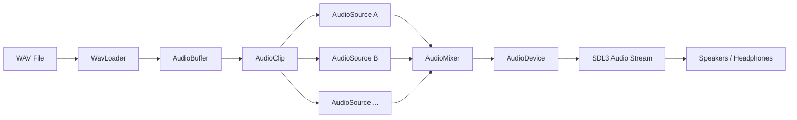
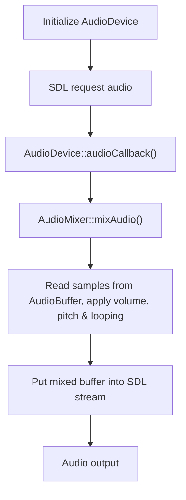

# C++ Audio Engine

> **Work in Progress**

A small audio engine in C++.

The project focuses on understanding how audio playback works below: loading WAV files, storing PCM samples, managing audio resources, mixing multiple audio sources, handling playback state, pitch and looping, and sending the final audio stream to an output device through SDL3.

## Features

- WAV file loader
- PCM audio conversion to floating-point samples
- Support for:
  - PCM 8-bit
  - PCM 16-bit
  - PCM 24-bit
  - PCM 32-bit
  - IEEE Float WAV
  - WAVE_FORMAT_EXTENSIBLE
- Audio clips and resource management
- Multiple simultaneous audio sources
- Play / Pause / Stop / Restart
- Pitch controlled playback
- Linear interpolation between samples
- Looping playback
- Mono to stereo channel mapping
- Real time audio mixing
- Output clipping protection
- SDL3 audio device and stream handling
- Unit tests using GoogleTest
- CMake-based build system

## Technologies

- C++20
- SDL3
- CMake
- GoogleTest
- Dear ImGui
- Visual Studio

## Architecture

The engine separates audio file parsing, audio data, playback state, mixing and hardware output into independent components.



### Main Components

```text
WavLoader
    Parses RIFF/WAVE files and converts samples to float PCM.

AudioBuffer
    Stores decoded interleaved PCM sample data.

AudioClip
    Represents an audio asset and references an AudioBuffer.

ResourceManager
    Loads audio assets and manages AudioBuffers and AudioClips.

AudioSource
    Stores playback state and controls an individual sound instance.

AudioMixer
    Mixes all active AudioSources into the final output buffer.

AudioDevice
    Connects the mixer with the SDL3 audio playback system.
```

## Audio Callback flow



## Building

Requirements:

- C++20 compatible compiler
- CMake 3.20+
- SDL3
- GoogleTest

Example:

```bash
cmake -S . -B build
cmake --build build
```

Run the application from the build directory.

Tests can be executed with:

```bash
ctest --test-dir build
```

## Tests

The project uses GoogleTest for unit testing.

Tests cover components such as:

- AudioBuffer
- AudioClip
- AudioMixer
- WavLoader
- ResourceManager

## Project Status

The project is currently **work in progress**.

This is an educational audio engine rather than a production-ready audio library.

### Planned Improvements

- UI via DearImGui
- Audio buses
- Low-pass and high-pass filters
- Simple EQ
- Sample rate conversion
- Runtime audio visualization
